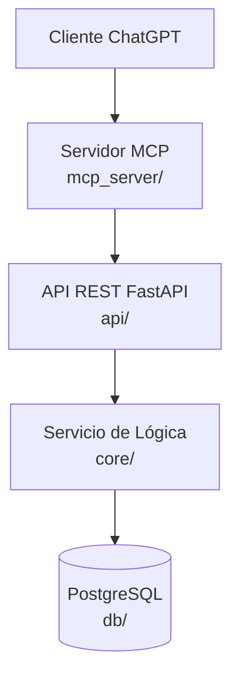
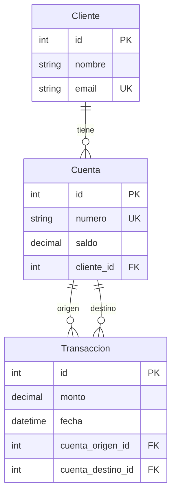

# Banking MCP - Sistema Bancario Multi-Capa

Sistema bancario con arquitectura hexagonal, DDD táctico, API REST dinámica y servidor MCP.

## Arquitectura





## Estructura del Proyecto

```
├── core/                  # Lógica de dominio (Hexagonal + DDD)
│   ├── models.py          # Modelos SQLAlchemy (Cliente, Cuenta, Transaccion)
│   ├── exceptions.py      # Excepciones de dominio
│   ├── repositories.py    # Interfaces abstractas (ABC)
│   ├── repos_impl.py      # Implementaciones SQLAlchemy
│   ├── unit_of_work.py    # Unit of Work (ABC)
│   └── services.py        # Servicio de transferencias
├── api/                   # API REST FastAPI
│   ├── main.py            # Punto de entrada FastAPI
│   ├── crud_factory.py    # Generador dinámico de CRUD
│   ├── schemas.py         # Esquemas Pydantic v2
│   ├── security.py        # JWT + autenticación
│   └── dependencies.py    # Inyección de dependencias
├── mcp_server/            # Servidor MCP
│   ├── server.py          # Servidor MCP (stdio)
│   ├── generator.py       # Generación dinámica de Tools desde OpenAPI
│   └── api_client.py      # Cliente HTTP asíncrono
├── tests/
│   ├── unit/              # Pruebas unitarias (TDD)
│   │   ├── conftest.py
│   │   └── test_transferencia_service.py
│   └── integration/       # Pruebas de integración
│       ├── conftest.py
│       └── test_repos.py
├── alembic/               # Migraciones de base de datos
├── Dockerfile.api         # Docker para API
├── Dockerfile.mcp         # Docker para MCP
├── docker-compose.yml     # Orquestación de servicios
├── alembic.ini            # Configuración de Alembic
└── requirements.txt       # Dependencias Python
```

## Instalación y Desarrollo

### Requisitos

- Python 3.11+
- Docker y Docker Compose
- pip

### Instalación Local

```bash
pip install -r requirements.txt

# Inicializar base de datos
alembic init alembic
alembic revision --autogenerate -m "init"
alembic upgrade head

# Ejecutar API
uvicorn api.main:app --reload

# Ejecutar MCP Server
python -m mcp_server.server
```

### Docker

```bash
docker-compose up --build
```

### Comandos Docker

| Comando | Descripción |
|---------|-------------|
| `docker-compose up -d` | Iniciar servicios en segundo plano |
| `docker-compose down` | Detener servicios |
| `docker-compose logs -f api` | Ver logs de la API |
| `docker-compose build --no-cache api` | Reconstruir sin caché |

## Uso del Agente (ChatGPT Desktop)

Configurar `claude_desktop_config.json`:

```json
{
  "mcpServers": {
    "banking": {
      "command": "python",
      "args": ["-m", "mcp_server.server"]
    }
  }
}
```

### Autenticación

```bash
# Obtener token
curl -X POST http://localhost:8000/login \
  -H "Content-Type: application/json" \
  -d '{"username": "admin", "password": "admin123"}'

# Usar token
curl http://localhost:8000/clientes/ \
  -H "Authorization: Bearer <token>"
```

## Ejecutar Pruebas

```bash
pytest tests/unit/ -v
pytest tests/integration/ -v
pytest tests/ -v
```

## Licencia

MIT
